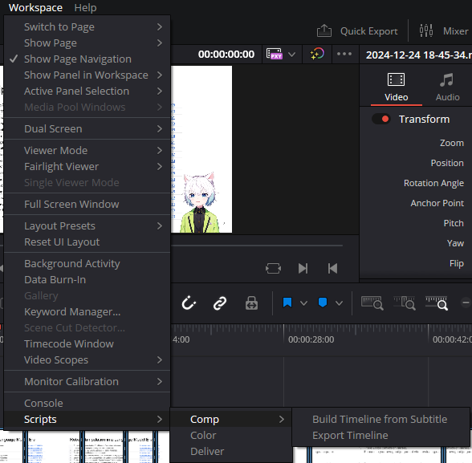
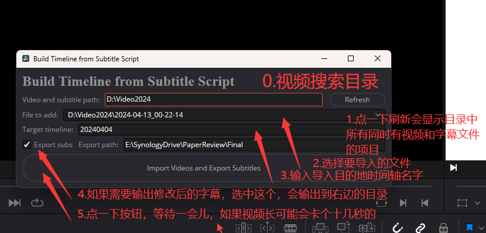

# 秋刀鱼谷视频后期工具箱

一个适合[我的频道](https://space.bilibili.com/823532)的视频后期工具箱。

## 日志
- 12/25/2024 Davinci Resolve v19.1免费版不支持使用本仓库中这种带GUI的插件，请不要升级; 增加了缓存上次使用的目录的功能; 修正了fps不同导致的视频长度计算错误bug
- 4/14/2024 根据字幕时间点前后的声音大小来精调字幕时间轴; 增加了arxiv标题查询工具
- 4/13/2024 创建了这个仓库

## 秋刀鱼都能懂的Windows用视频工作流
这是一个我的频道流水线上的[普通视频](https://www.bilibili.com/video/BV12F4m1N7Mc/)，在新的工作流中，它的制作非常容易：
1. 在[Google Slides](https://docs.google.com/presentation)上准备所有材料
2. 使用[OBS](https://obsproject.com/)录制一整个长的视频，包括忘词口胡等等都不要停
3. 使用[subs.py](subs.py)调用[faster_whisper](https://github.com/SYSTRAN/faster-whisper)产生与视频匹配的字幕
4. 使用[Subtitle Edit](https://github.com/SubtitleEdit/subtitleedit)编辑产生的字幕，在这一阶段去掉各种不可公开的片段并校对字幕，只需要保留要保留的视频片段对应的字幕即可，必要时调整时间轴
5. 以下操作(5-7)在[Davinci Resolve](https://www.blackmagicdesign.com/products/davinciresolve)中进行，这里只是大致介绍，后面的章节有更详细的使用方法。使用[这个插件](<Comp/Build Timeline from Subtitle.py>)，根据字幕文件中的时间轴，把视频切片创建成一个Davinci Resolve中的时间轴，同时导出最终视频的字幕。
6. 在Davinci Resolve中Normalize时间轴中的音频
7. 在Davinci Resolve中使用[这个脚本](Comp/Export Timeline.py)导出成品视频
8. 使用[Microsoft Powerpoint](https://www.microsoft.com/en-us/microsoft-365/powerpoint)与特定的模板制作封面
9. 编辑`arxiv_info.txt`第一行为要查询的arxiv论文的ID，运行[arxiv_info.py](arxiv_info.py)，格式化的论文信息会重新输出到`arxiv_info.txt`
10. 手动上传到[我的频道](https://space.bilibili.com/823532)，并更新[这个文档](https://docs.qq.com/sheet/DSUdOTG9xWUdydVB6)
11. 等待审核结束，添加字幕，添加视频到合集
12. 和观众吹一会儿牛，然后摸了

## 步骤3中subs.py的使用方法
更改第10行`'video_path': 'D:\\Video2025'`为存放视频的目录，代码会扫描目录下所有没有相应`srt`字幕文件的`mkv`视频，然后尝试生成字幕。

## 在Davinci Resolve中使用插件的方法
1. 复制`Comp`目录中的所有内容到你的Davinci Resolve的插件目录，比如我的是`C:\ProgramData\Blackmagic Design\DaVinci Resolve\Fusion\Scripts\Comp`
2. 然后你就可以在菜单中找到这两个脚本/插件，选中即可启动

3. 使用Build Timeline from Subtitle根据字幕导入切好的视频，方法见图

4. 记得Normalize时间轴中的音频
5. 使用Export Timeline后会自动创建渲染任务（默认YouTube - 1080P预设），自己点一下渲染即可

## 步骤9中arxiv_info.py的使用方法
1. 第一次使用时直接运行，会自动创建`arxiv_info.txt`这个文件
2. 在`arxiv_info.txt`的第一行输入包含arxiv论文ID的文本（比如论文的摘要链接、论文pdf链接等等）
3. 再次运行`arxiv_info.py`会自动用查到的信息覆盖`arxiv_info.txt`

## 不需要使用的env.bat
如题，这个是在让Davinci Resolve使用外部脚本的时候需要设置的环境变量，但外部脚本一直拿不到resolve，就算了，放在这里也许谁能用得到。

## 结论：真的是非常简单呢！
虽然我现在也没觉得新工作流节约的时间能比准备这个新工作流花费的时间要多，但是写轮子总是快乐的（x

## Acknowledgement
在Davinci的插件开发中大量参考了项目自带的示例（`C:\ProgramData\Blackmagic Design\DaVinci Resolve\Support\Developer\Workflow Integrations\Examples`和`C:\ProgramData\Blackmagic Design\DaVinci Resolve\Support\Developer\Scripting\Examples`），
以及[这个文档](https://resolve.cafe/developers/scripting/)(其实你本地也有一份在`C:\ProgramData\Blackmagic Design\DaVinci Resolve\Support\Developer\Scripting\README.txt`)，和这个[UI文档](https://resolvedevdoc.readthedocs.io/en/latest/UI_elements_attrb.html#window)。插件的UI虽然没有官方文档，但是据说操作逻辑和[Qt](https://www.qt.io/)是相似的。

## TODO
- 能不能自动normalize音频啊
